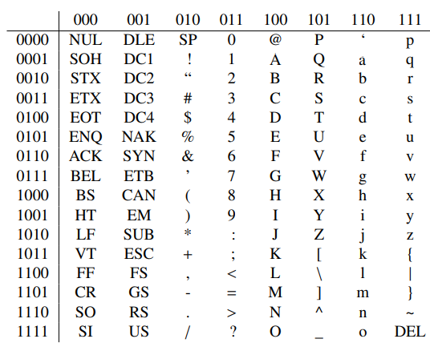
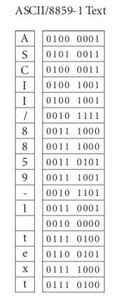

# Codage binaire de l’information

## Codage binaire de l’information

L’ordinateur ne comprend que 0 et 1
Le 0 et le 1 sont représentés par deux tensions.
L’ordinateur est une machine électronique, c’est-à-dire en fin de compte il ne comprend que deux chose : le courant passe ou non. 
De cette caractéristique nous pouvons comprendre que l’information doit être coder en 0 et 1 pour que l’ordinateur arrive à manipuler ses données.

## Types d’informations

Une information numérique peut être de deux types :
Une instruction, qui représente une opération réalisée par un organe de calcul (un microprocesseur par exemple) ;
Une donnée, sur laquelle des instructions pourront être faites.
Parmi les données, il existe des sous-catégories qui ne seront pas traitées de la même manière par les systèmes informatiques. 
Parmi ces données, on peut citer :
–	des données non numériques (caractère alphanumérique) ;
–	des données numériques :
o	entiers naturels (0 ; 1 ; 315 ...)
o	entiers relatifs (-1578 ; -15 ; -1 ...)
o	réels (3.1415 ; 4587.598 ...)
Un regroupement de 8 bits s’appelle un octet

## Représentation de l’information

Les informations numériques sont transmises par des signaux électriques. Afin d’avoir un langage universel, ces données sont représentées sous forme binaire, c’est à dire une suite de 0 et de 1.
L’information élémentaire est appelé BIT (Binary digit).
Un mot binaire est un regroupement de n bits. Il permet d’obtenir 2n combinaisons différentes.
 
## Codage des caractères alphanumériques

Pour coder un texte, il suffit de savoir coder une lettre (on parle de caractères). Pour coder chaque caractère avec un nombre, il existe plusieurs codages : l'ASCII, l'Unicode, etc. 
Le codage le plus ancien, l'ASCII, est intégralement défini par une table de correspondance entre une lettre et le nombre associé : la table ASCII. 

## Code ASCII – (American Standard Code for Information Interchange)
Ce standard ASCII utilise des nombres codés sur 7 bits, et peut donc coder 128 symboles différents. 
Les lettres sont stockées dans l'ordre alphabétique, pour simplifier la vie des utilisateurs : des nombres consécutifs correspondent à des lettres consécutives.
 
 

 
 
## Limite de ASCCI
La table ASCII a cependant des limitations assez problématiques. Par exemple, vous remarquerez que les accents n'y sont pas, ce qui n'est pas étonnant quand on sait qu'il s'agit d'un standard américain. 
Pour combler ce manque, de nombreux autres codages du texte sont apparus, le plus connu étant certainement l’Unicode. 

## Unicode
Pour plus de simplicité, l'Unicode est parfaitement compatible avec la table 

## ASCII : 
Au départ, les caractères étaient codés sur 16 bits. Depuis, il a été étendu à 32 bits
Les 128 premiers symboles de l’Unicode sont ceux de la table ASCII, et sont rangés dans le même ordre. 
Là où l'ASCII ne code que l'alphabet anglais, les codages actuels comme l'Unicode prennent en compte les caractères chinois, japonais, grecs, etc.
 
## Codage des données numériques

Système binaire
https://fr.wikipedia.org/wiki/Syst%C3%A8me_binaire
Codage des nombres

Codage binaire.
Saisie et présentation de l’information

Conversion de l’information en série de deux état 
Comment présenter l’information en utilisant que deux information : Oui, et Nom
Selon la forme d’information et données il y a plusieurs solutions 
Solution pour la forme : Nombre
La solution est chez le mathématicien les nombre peuvent se présenter dans la base binaire.
Rappel : Base binaire et décimale
Solution pour la forme : Texte
Le texte peut être devisé en plusieurs caractères.
La solution est un peu bête : nous donne pour chaque caractère une valeur binaire.

Comme résultat nous aurons un tableau qui fait le relation entre les caractères et leurs valeurs binaires.
Exemple d’un tableau de code ASCCI :
## Références
http://hebergement.u-psud.fr/villemejane/IOGS/EITI/S6-ETI/GEII_ElecNum/GEII_ElecNum_Codage_Poly.pdf
