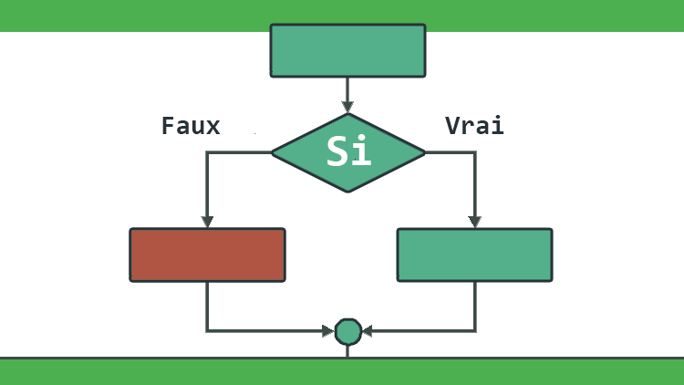

# Introduction

Après 10 ans d’enseignement de la formation d’initiation à la programmation pour les jeunes entre 18 et 25 ans. 

J’ai décidé de réaliser cette formation intitulé : « Les 4 catégories d’ordre d’un algorithme » pour aider mes nouveaux apprenants à éviter les difficultés d’apprentissage de quelques notions de base. 

Notamment, Les difficultés que j’ai rencontré avec mes anciens apprenants pendant mon expérience comme formateur.

