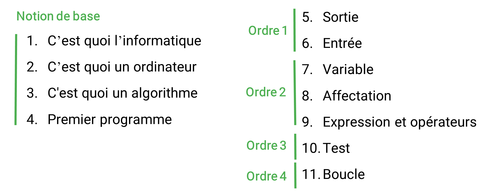

# Plan de la formation

La formation est divisée en 5 parties.

- Notion de base, 
- et les 4 catégories d’ordre compréhensible par l’ordinateur.
  

Dans la première partie intitulée « Notion de base » je vais vous montrer 

-	C’est quoi l’informatique, 
-	C’est quoi un ordinateur, 
-	C'est quoi un algorithme 
-	et je vais terminer par vous montrer comment réaliser votre premier programme. 

Dans les parties suivants, je vais vous assister à comprendre les 4 catégories d’ordre compréhensible par l’ordinateur,

Tout d’abord, je commencerai par la catégorie d’ordre 1 intitulé : Entrée et Sortie.

Ensuite : dans la catégorie d’ordre 2 : je vais traiter avec vous la notion du variable et d’affectation en détaillant le chapitre « Expression et opérateurs ».

Enfin, dans les deux dernières parties je vais vous expliquer en détail la notion de Test et Boucle,

Pendent, la formation, je vais essayer de détailler et d’aller doucement avec les notions que j’ai senti leur difficultés d’apprentissage avec mes anciens apprenants.

Je vais utiliser pour ça des outils pour simuler l’exécution des exemples que je vais utiliser pendant la formation de façon à montrer son exécution sur l’écran et dans la mémoire de l’ordinateur.

Finalement. Je vous souhaite bon apprentissage

